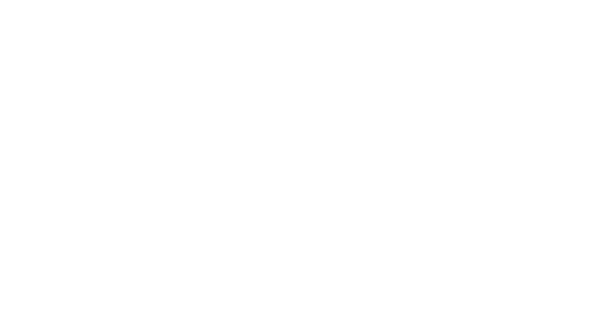
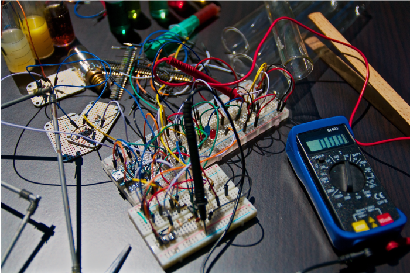
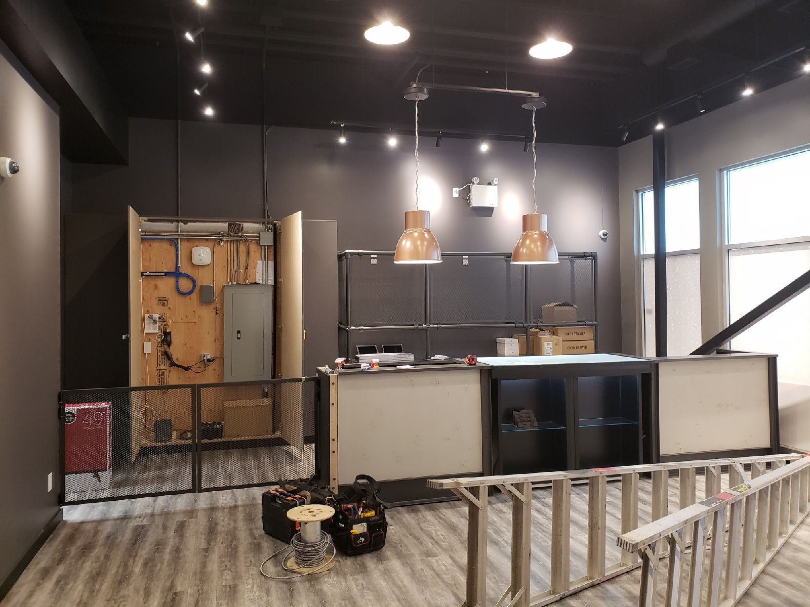
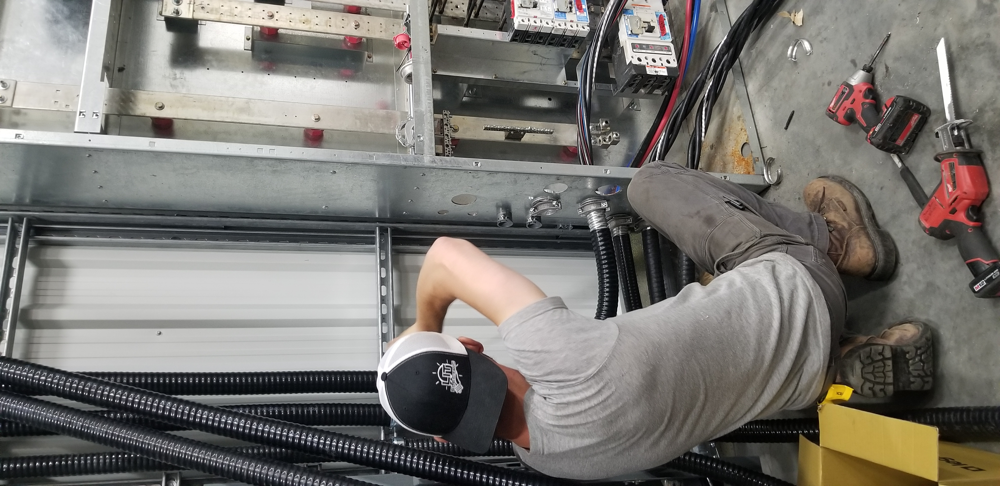
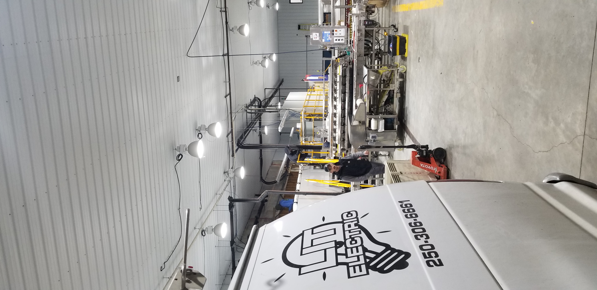
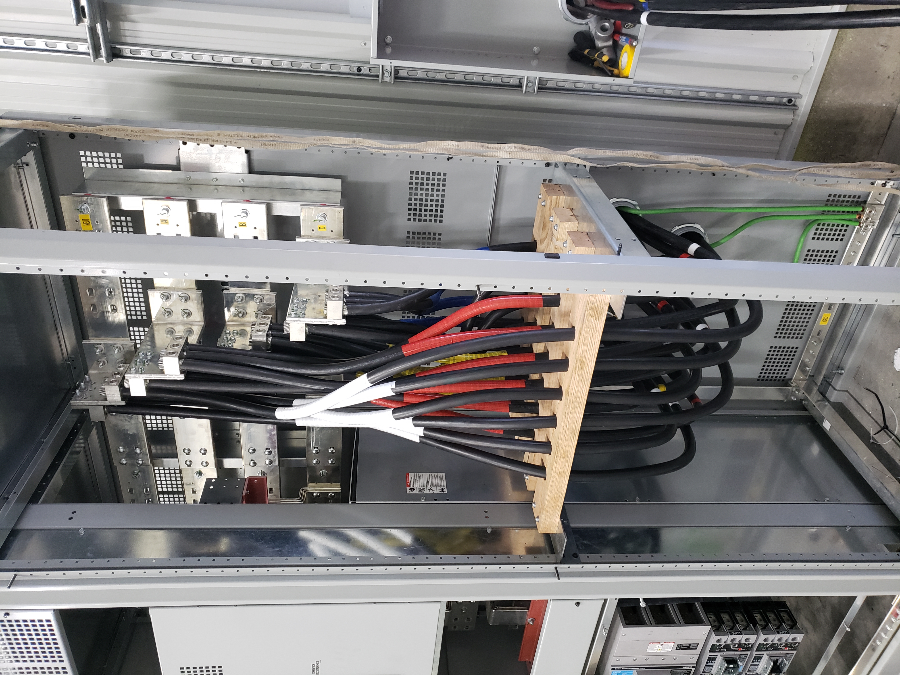
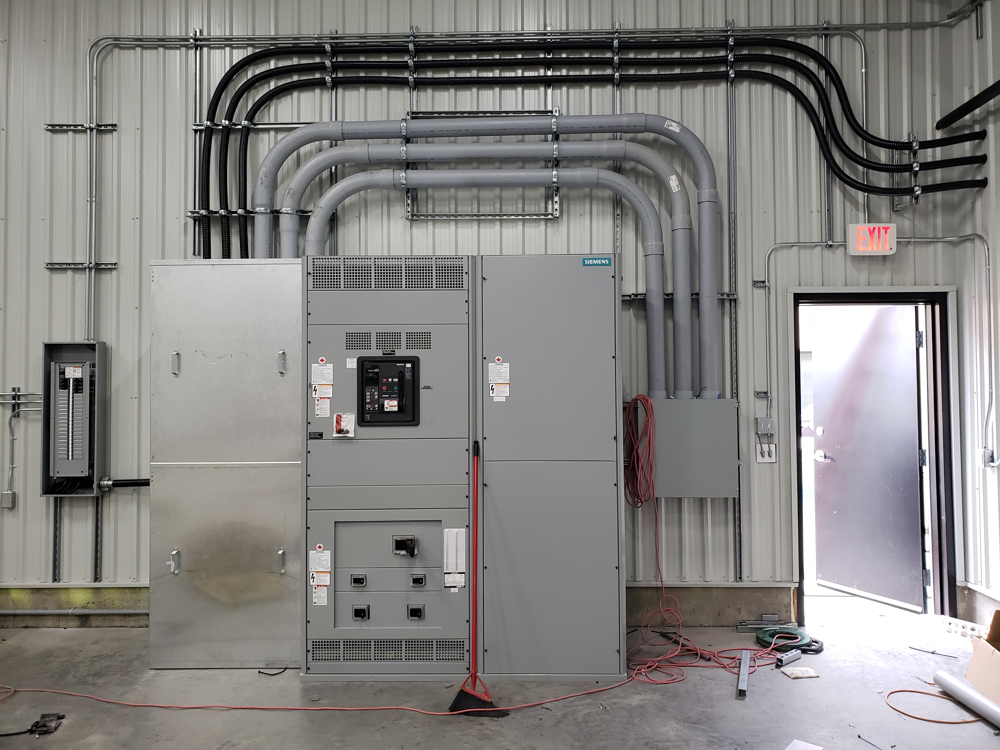

 Commercial Services                 WebFont.load({ google: { families: \["Open Sans:300,300italic,400,400italic,600,600italic,700,700italic,800,800italic","Montserrat:100,100italic,200,200italic,300,300italic,400,400italic,500,500italic,600,600italic,700,700italic,800,800italic,900,900italic"\] }}); !function(o,c){var n=c.documentElement,t=" w-mod-";n.className+=t+"js",("ontouchstart"in o||o.DocumentTouch&&c instanceof DocumentTouch)&&(n.className+=t+"touch")}(window,document);   window.dataLayer = window.dataLayer || \[\];function gtag(){dataLayer.push(arguments);}gtag('js', new Date());gtag('config', 'UA-155343786-2', {'anonymize\_ip': false});

**Commercial Services**
=======================

[Home](index.html)

Services

[Residential](residential-services.html) [Commercial](commercial-services.html) [Gemstone lights](gemstone-lights.html)

[About](#) [Contact](contact.html)

Commercial Electricians  
‍**You Can Rely On  
**
=================================================

Looking to take your office space to the next level, or maybe just relocate a piece of equipment? Whatever you need our electricians are experienced here in the Okanagan to service the commercial sector. Your time and business are valuable, let us help. Give us a call or email today for an estimate!   

### Services

*   Tenant Improvements
*   New Construction
*   Electric Diagnosis and Repair
*   Office and Warehouse Projects
*   Specialty Lighting
*   Electrical Panel Upgrades
*   Sub Panel Installation
*   Energy Efficient Lighting Upgrades
*   Ballast and Bulb Replacement
*   Outdoor Lighting

Completed Commercial Projects
-----------------------------

 [ { "items": \[ { "\_id": "5f07699624d04cc4a27fb8fb", "origFileName": "Commercial3.jpeg", "fileName": "Commercial3.jpeg", "fileSize": 573702, "height": 1200, "url": "images/Commercial3.jpeg", "width": 1600, "type": "image" } \], "group": "gallery" }](#)[ { "items": \[ { "\_id": "5f07699d97b23c827a476410", "origFileName": "Cowmercial.jpg", "fileName": "Cowmercial.jpg", "fileSize": 2707819, "height": 4032, "url": "images/Cowmercial.jpg", "width": 1960, "type": "image" } \], "group": "gallery" } ](#)[ { "items": \[ { "\_id": "5f07699c4321d047be3621a0", "origFileName": "DopeShotcommefcial\_.jpg", "fileName": "DopeShotcommefcial\_.jpg", "fileSize": 2400472, "height": 4032, "url": "images/DopeShotcommefcial\_.jpg", "width": 1960, "type": "image" } \], "group": "gallery" } ](#)[ { "items": \[ { "\_id": "5f07699e908f31a389b58c63", "origFileName": "Commercial (2).jpg", "fileName": "Commercial (2).jpg", "fileSize": 3900453, "height": 4032, "url": "images/Commercial-2.jpg", "width": 3024, "type": "image" } \], "group": "gallery" } ](#)[ { "items": \[ { "\_id": "5f07699e56d6e5253dc6e0db", "origFileName": "Commerc.jpg", "fileName": "Commerc.jpg", "fileSize": 4132237, "height": 3024, "url": "images/Commerc.jpg", "width": 4032, "type": "image" } \], "group": "gallery" }](#)

No items found.

Enquire now
===========

Feel free to get in touch if you have any questions. We will reply a soon as possible.  
  
Alternatively, you can reach us by phone at (250) 306-6661 between 8am and 5pm, Monday to Friday.  

NameEmailPhone numberYour message

Thank you! Your message has been received.  
  
We'll get back to you as soon as possible.  

Oops! Something went wrong while submitting the form.

Copyright © 2020, Lit Electric

[Home](#) [Contact](#) [Privacy & Terms](#)