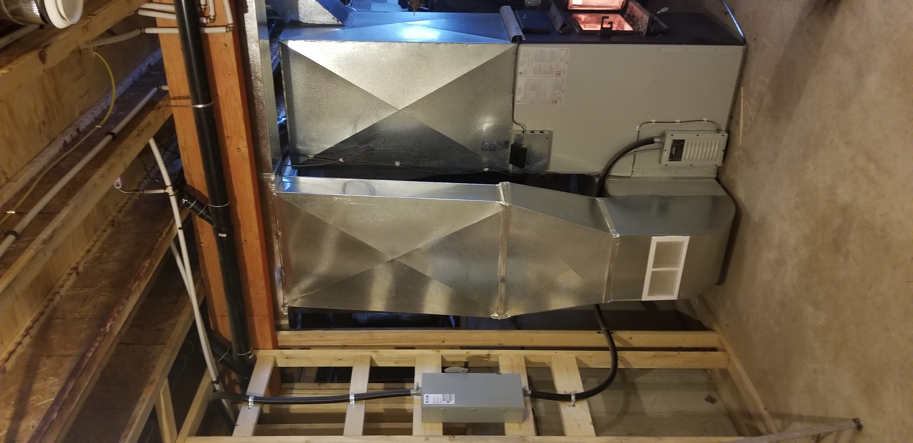
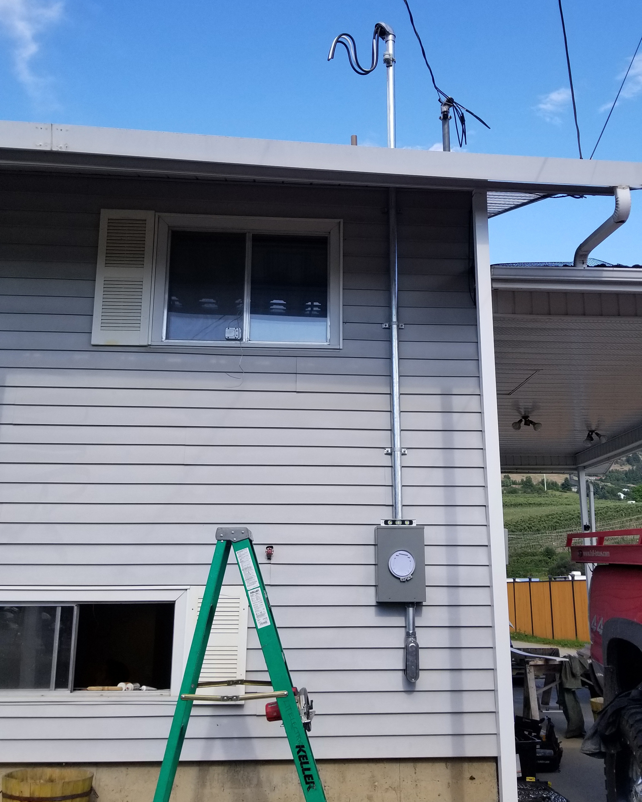

 Residential Services                 WebFont.load({ google: { families: \["Open Sans:300,300italic,400,400italic,600,600italic,700,700italic,800,800italic","Montserrat:100,100italic,200,200italic,300,300italic,400,400italic,500,500italic,600,600italic,700,700italic,800,800italic,900,900italic"\] }}); !function(o,c){var n=c.documentElement,t=" w-mod-";n.className+=t+"js",("ontouchstart"in o||o.DocumentTouch&&c instanceof DocumentTouch)&&(n.className+=t+"touch")}(window,document);   window.dataLayer = window.dataLayer || \[\];function gtag(){dataLayer.push(arguments);}gtag('js', new Date());gtag('config', 'UA-155343786-2', {'anonymize\_ip': false});

**Residential Services**
========================

Residential Electricians  
‍**You Can Rely On  
**
==================================================

Our residential electricians believe that your home needs to be treated with respect. Whether you need a fan installed or a home renovation, we’ll leave it cleaner than it was when we arrived. Pet friendly and privacy conscious our goal is to leave the smallest footprint in your home. Give us a call or email today for an estimate!  

### Services

*   Home Renovations  
    
*   New Construction  
    
*   Ev Charger Installation  
    
*   Home Energy Savings  
    
*   Panel/Service Upgrades  
    
*   Ceiling and Exhaust Fan Installation  
    
*   Diagnosis and Repair  
    
*   Landscape Lighting  
    
*   Knob and Tube Replacement  
    
*   Aluminum Wiring Upgrade or Replacement  
    
*   Silver Label Certification  
    

Completed Residential Projects
------------------------------

 [ { "items": \[ { "\_id": "5f07699c54871a162c96c0f4", "origFileName": "Residentialo.jpg", "fileName": "Residentialo.jpg", "fileSize": 2362885, "height": 4032, "url": "images/Residentialo.jpg", "width": 1960, "type": "image" } \], "group": "gallery" }](#)[ { "items": \[ { "\_id": "5f076bf7f795d869db129057", "origFileName": "Resi3.jpg", "fileName": "Resi3.jpg", "fileSize": 2464915, "height": 2450, "url": "images/Resi3.jpg", "width": 1960, "type": "image" } \], "group": "gallery" } ](#)[ { "items": \[ { "\_id": "5f076aee0f194e16eb76489c", "origFileName": "Resi2.jpg", "fileName": "Resi2.jpg", "fileSize": 2468297, "height": 4032, "url": "images/Resi2.jpg", "width": 1960, "type": "image" } \], "group": "gallery" } ](#)[ { "items": \[ { "\_id": "5f07699d889b8cc46f25a9f4", "origFileName": "Residentialll.jpg", "fileName": "Residentialll.jpg", "fileSize": 2596685, "height": 4032, "url": "images/Residentialll.jpg", "width": 1960, "type": "image" } \], "group": "gallery" } ](#)[ { "items": \[ { "\_id": "5f076aef70679c275489ac74", "origFileName": "Resi4.jpg", "fileName": "Resi4.jpg", "fileSize": 2681780, "height": 3849, "url": "images/Resi4.jpg", "width": 2268, "type": "image" } \], "group": "gallery" }](#)

No items found.

Enquire now
===========

Feel free to get in touch if you have any questions. We will reply a soon as possible.  
  
Alternatively, you can reach us by phone at (250) 306-6661 between 8am and 5pm, Monday to Friday.  

NameEmailPhone numberYour message

Thank you! Your message has been received.  
  
We'll get back to you as soon as possible.  

Oops! Something went wrong while submitting the form.

Copyright © 2020, Lit Electric

[Home](#) [Contact](#) [Privacy & Terms](#)

[Home](index.html)

Services

[Residential](residential-services.html) [Commercial](commercial-services.html) [Gemstone lights](gemstone-lights.html)

[About](#) [Contact](contact.html)